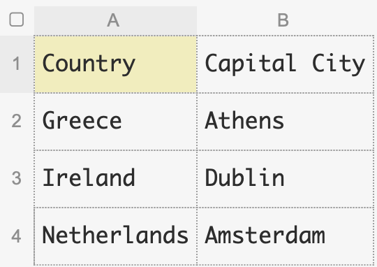
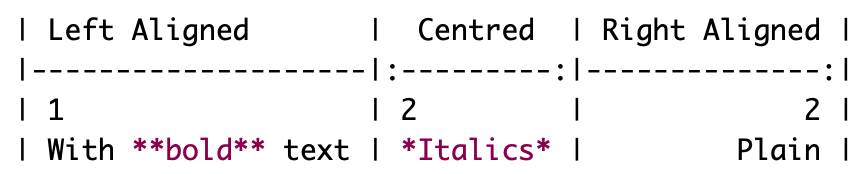
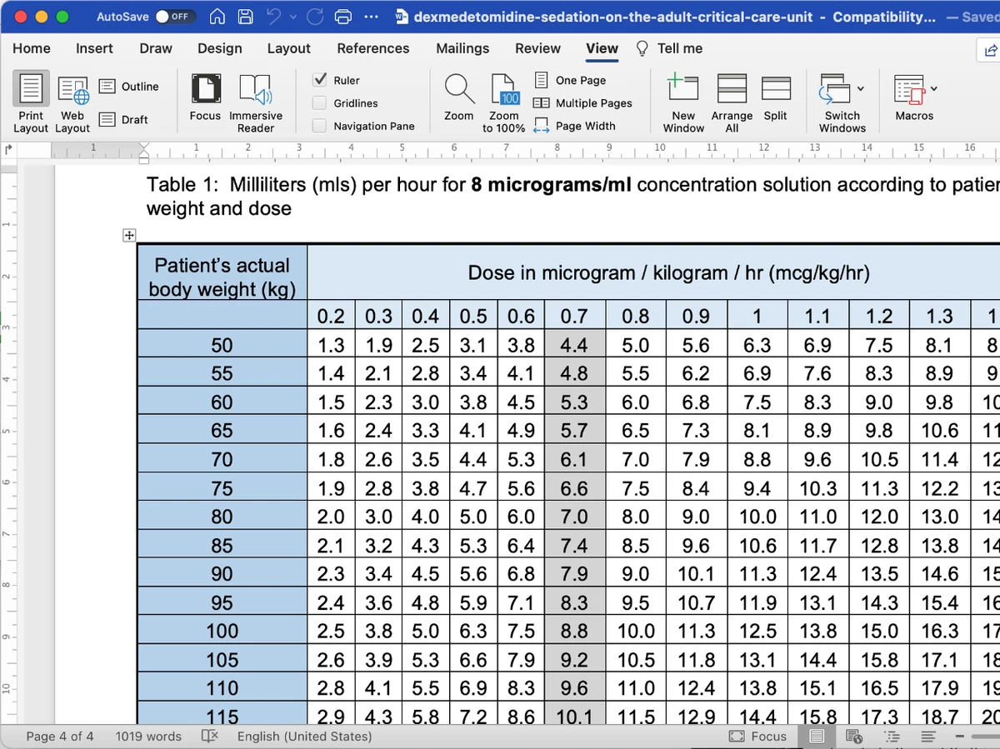
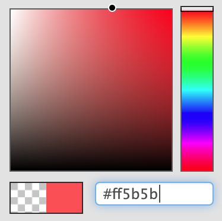
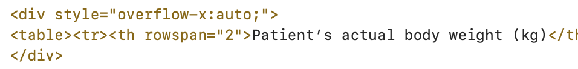

# Tables [Making tables that look good and display well on phones and computers]

We'll be using [Markdown Tables Generator](https://www.tablesgenerator.com/markdown_tables) for simple tables, and [HTML Tables Generator](https://www.tablesgenerator.com/html_tables) for more complex tables.

## Simple Tables

A simple table has:

* Headings at the top, or no heading
* No merged cells
* Not too big

| Number | Odd or Even | Prime |
|:------:|-----------|-----|
| **1**    | Odd         | No    |
| **2**    | Even        | Yes   |

>> Creating a simple table

## Steps

1. Put the table in Excel
    * If you are starting with a table in Word or Powerpoint, copy and paste it into Excel. The next stage works better if you do.
2. Go to [Markdown Tables Generator](https://www.tablesgenerator.com/markdown_tables) https://www.tablesgenerator.com/markdown_tables
3. Select File->Paste table data..., copy the table from Excel and paste here
    * This is the bit that can go wonky if you try to paste a table from Word
4. Click 'Generate' then 'Copy to Clipboard'
5. Paste into your guideline and you're done, should be human readable too

## Formatting is automatically applied

The styling of headers and rows happens automatically when the table is displayed. You don't need to add it yourself.

Becomes:

| Country     | Capital City |
|-------------|--------------|
| Greece      | Athens       |
| Ireland     | Dublin       |
| Netherlands | Amsterdam    |

## Column alignment, bold and italics

| Left Aligned       |  Centred  | Right Aligned |
|--------------------|:---------:|--------------:|
| 1                  | 2         |             3 |
| With **bold** text | *Italics* |         Plain |

tablesgenerator.com allows you to set the column alignment and to make words bold or italic. Just remember to press 'Generate' again.

It's also fairly simple to do yourself in markdown. You make things bold or italic as normal, and it's the colons in the divider that set the column alignment.

## No heading

Put a blank row at the top of your table.

|     |     |
|-----|-----|
| One | Two |
| 1   | 2   |
<<
## Advanced Tables

### Merged Cells

The main reason to use an advanced table is to merge cells.

<table>
  <tr>
    <th>Route</th>
    <th>Range</th>
    <th>Regular Dose</th>
    <th>Max doses</th>
  </tr>
  <tr>
    <td rowspan="4">PO / PR</td>
    <td rowspan="3">&lt;&nbsp;50kg</td>
    <td rowspan="3">15 mg/kg 4–6 hourly</td>
    <td>PO&nbsp;Loading dose: 20-30mg /kg may be given</td>
  </tr>
  <tr>
    <td>PR&nbsp;Loading dose: 30-40mg/kg may be given</td>
  </tr>
  <tr>
    <td>Max. 75 mg/kg daily*.&nbsp;&nbsp;Not exceeding 4g/day</td>
  </tr>
  <tr>
    <td>&gt;&nbsp;50kg</td>
    <td>1 g&nbsp;&nbsp;4–6 hourly</td>
    <td>Max.&nbsp;&nbsp;4g / 24 hours</td>
  </tr>
</table>

### Other reasons

* Headings on the left
* Custom background colours
* Scrolling - as it is too wide and can't be split into smaller tables
* Any other advanced table formatting

### Prefer simple tables if possible

In your original text-only document the simple tables are human readable, they look like a table. The advanced tables are in HTML code, and look like code in your original document rather than a table.

>> Creating an advanced table

## The basic starting point - including merging cells

We start by creating a HTML table, then we can add our extra bits on top.

1. Put the table in Excel. As before:
    * Don't worry about formatting
    * If you are starting with a table in Word, copy and paste it into Excel first
2. Go to [HTML Tables Generator](https://www.tablesgenerator.com/html_tables)
3. Select File->Paste table data..., copy the table from Excel and paste here
    * This is the bit that can go wonky if you try to paste a table from Word
4. Tick 'Do not generate CSS'
    * This is so the guidelines app can apply its normal styling
5. Merge cells if desired - select them and press the merge cell button on the toolbar
6. Click 'Generate' then 'Copy to Clipboard'
7. Paste into your guideline
    * Your table should display right, but sadly your original guideline document probably looks like a whole pile of computer code has been dumped in it.

## Headings on the left, or anywhere else

In the HTML for your table find the cells that you want to turn into headings. Where it says `<td>Your Cell</td>` change 'td' to 'th': `<th>Your Cell</th>`

>> Example

# Extra Headings Example

<table><tr><th rowspan="2">Patient’s actual body weight (kg)</th><th colspan="13">Dose in microgram / kilogram / hr  (mcg/kg/hr)</th></tr><tr><th>0.2</th><th>0.3</th><th>0.4</th><th>0.5</th><th>0.6</th><th>0.7</th><th>0.8</th><th>0.9</th><th>1.0</th><th>1.1</th><th>1.2</th><th>1.3</th><th>1.4</th></tr><tr><th>50</th><td>1.3</td><td>1.9</td><td>2.5</td><td>3.1</td><td>3.8</td><td>4.4</td><td>5.0</td><td>5.6</td><td>6.3</td><td>6.9</td><td>7.5</td><td>8.1</td><td>8.8</td></tr><tr><th>55</th><td>1.4</td><td>2.1</td><td>2.8</td><td>3.4</td><td>4.1</td><td>4.8</td><td>5.5</td><td>6.2</td><td>6.9</td><td>7.6</td><td>8.3</td><td>8.9</td><td>9.6</td></tr><tr><th>60</th><td>1.5</td><td>2.3</td><td>3.0</td><td>3.8</td><td>4.5</td><td>5.3</td><td>6.0</td><td>6.8</td><td>7.5</td><td>8.3</td><td>9.0</td><td>9.8</td><td>10.5</td></tr><tr><th>65</th><td>1.6</td><td>2.4</td><td>3.3</td><td>4.1</td><td>4.9</td><td>5.7</td><td>6.5</td><td>7.3</td><td>8.1</td><td>8.9</td><td>9.8</td><td>10.6</td><td>11.4</td></tr><tr><th>70</th><td>1.8</td><td>2.6</td><td>3.5</td><td>4.4</td><td>5.3</td><td>6.1</td><td>7.0</td><td>7.9</td><td>8.8</td><td>9.6</td><td>10.5</td><td>11.4</td><td>12.3</td></tr><tr><th>75</th><td>1.9</td><td>2.8</td><td>3.8</td><td>4.7</td><td>5.6</td><td>6.6</td><td>7.5</td><td>8.4</td><td>9.4</td><td>10.3</td><td>11.3</td><td>12.2</td><td>13.1</td></tr><tr><th>80</th><td>2.0</td><td>3.0</td><td>4.0</td><td>5.0</td><td>6.0</td><td>7.0</td><td>8.0</td><td>9.0</td><td>10.0</td><td>11.0</td><td>12.0</td><td>13.0</td><td>14.0</td></tr><tr><th>85</th><td>2.1</td><td>3.2</td><td>4.3</td><td>5.3</td><td>6.4</td><td>7.4</td><td>8.5</td><td>9.6</td><td>10.6</td><td>11.7</td><td>12.8</td><td>13.8</td><td>14.9</td></tr><tr><th>90</th><td>2.3</td><td>3.4</td><td>4.5</td><td>5.6</td><td>6.8</td><td>7.9</td><td>9.0</td><td>10.1</td><td>11.3</td><td>12.4</td><td>13.5</td><td>14.6</td><td>15.8</td></tr><tr><th>95</th><td>2.4</td><td>3.6</td><td>4.8</td><td>5.9</td><td>7.1</td><td>8.3</td><td>9.5</td><td>10.7</td><td>11.9</td><td>13.1</td><td>14.3</td><td>15.4</td><td>16.6</td></tr><tr><th>100</th><td>2.5</td><td>3.8</td><td>5.0</td><td>6.3</td><td>7.5</td><td>8.8</td><td>10.0</td><td>11.3</td><td>12.5</td><td>13.8</td><td>15.0</td><td>16.3</td><td>17.5</td></tr><tr><th>105</th><td>2.6</td><td>3.9</td><td>5.3</td><td>6.6</td><td>7.9</td><td>9.2</td><td>10.5</td><td>11.8</td><td>13.1</td><td>14.4</td><td>15.8</td><td>17.1</td><td>18.4</td></tr><tr><th>110</th><td>2.8</td><td>4.1</td><td>5.5</td><td>6.9</td><td>8.3</td><td>9.6</td><td>11.0</td><td>12.4</td><td>13.8</td><td>15.1</td><td>16.5</td><td>17.9</td><td>19.3</td></tr><tr><th>115</th><td>2.9</td><td>4.3</td><td>5.8</td><td>7.2</td><td>8.6</td><td>10.1</td><td>11.5</td><td>12.9</td><td>14.4</td><td>15.8</td><td>17.3</td><td>18.7</td><td>20.1</td></tr><tr><th>120</th><td>3.0</td><td>4.5</td><td>6.0</td><td>7.5</td><td>9.0</td><td>10.5</td><td>12.0</td><td>13.5</td><td>15.0</td><td>16.5</td><td>18.0</td><td>19.5</td><td>21.0</td></tr></table>
<<
## Background colours and other formatting

Leave 'Do not generate CSS' unticked (so it does generate CSS) and you have full control and do anything that [HTML Tables Generator](https://www.tablesgenerator.com/html_tables) allows.

This overrides some of the normal table styling. The main things work like header colour, and alternating row colour, but other subtle things are changed. To get closer to the native style apply these changes in tablegenerator.com:

* Select the header rows and make them centre aligned and bold
* Change the font to 'inherit (from parent element)'

>> Background Colours Example - Red, Amber, Green

<table>
  <tr>
    <th>Category</th>
    <th>Clinical Status</th>
    <th>Suggested action</th>
  </tr>
  <tr>
    <td style="background-color:#60c060;font-weight:bold;">Green</td>
    <td><strong>RR ≥20 with SpO₂ ≤94%</strong></td>
    <td>Administer O₂ &lt;40% by face mask. If SpO₂ rises to &gt;94% observe and monitor</td>
  </tr>
  <tr>
    <td style="background-color:#ffa64d;font-weight:bold;">Amber</td>
    <td><strong>RR ≥20 with SpO₂ ≤94% on FiO₂ ≥ 40%</strong></td>
    <td>
Start 15 L/min O₂ via non- rebreathe mask.
Senior clinical review to consider: If orientated and able to tolerate well fitted non-vented face mask trial CPAP 10cm H₂O with FiO₂ 60%</td>
  </tr>
  <tr>
    <td style="background-color:#ff5b5b;font-weight:bold;">Red</td>
    <td><strong>RR ≥20 with SpO₂ ≤94% on 15L/min via non-rebreathe mask and CPAP trial felt inappropriate (eg rapidly deteriorating)</strong> Or <strong>CPAP 10 FiO₂ 60%</strong></td>
    <td>
If further escalation appropriate: urgent critical care review and transfer to ITU for further treatment.
If escalation ITU not appropriate: can increase CPAP 12-15 cmH₂O and FiO₂ 60-100%</td>
  </tr>
</table>

To get the same colours as above paste these values into the colour picker on tablesgenerator.com:

* Green: #60c060
* Amber: #ffa64d
* Red: #ff5b5b

<<
## Scrollable Tables

If a table ends up too wide to fit on a phone screen then the extra will be cut off. The table can be made scrollable so the reader can scroll to see the extra parts of the table.

This seems to be a requirement for iPhones only. Android phones make wide tables scrollable by default.

>> How to make a table scrollable

# Scrollable Tables

Wrap your HTML table with `
` on the line before, and `
` on the line after.

This been done for the following table which too wide to be viewed on most phones. 

<table><tr><th rowspan="2">Patient’s actual body weight (kg)</th><th colspan="13">Dose in microgram / kilogram / hr  (mcg/kg/hr)</th></tr><tr><th>0.2</th><th>0.3</th><th>0.4</th><th>0.5</th><th>0.6</th><th>0.7</th><th>0.8</th><th>0.9</th><th>1.0</th><th>1.1</th><th>1.2</th><th>1.3</th><th>1.4</th></tr><tr><th>50</th><td>1.3</td><td>1.9</td><td>2.5</td><td>3.1</td><td>3.8</td><td>4.4</td><td>5.0</td><td>5.6</td><td>6.3</td><td>6.9</td><td>7.5</td><td>8.1</td><td>8.8</td></tr><tr><th>55</th><td>1.4</td><td>2.1</td><td>2.8</td><td>3.4</td><td>4.1</td><td>4.8</td><td>5.5</td><td>6.2</td><td>6.9</td><td>7.6</td><td>8.3</td><td>8.9</td><td>9.6</td></tr><tr><th>60</th><td>1.5</td><td>2.3</td><td>3.0</td><td>3.8</td><td>4.5</td><td>5.3</td><td>6.0</td><td>6.8</td><td>7.5</td><td>8.3</td><td>9.0</td><td>9.8</td><td>10.5</td></tr><tr><th>65</th><td>1.6</td><td>2.4</td><td>3.3</td><td>4.1</td><td>4.9</td><td>5.7</td><td>6.5</td><td>7.3</td><td>8.1</td><td>8.9</td><td>9.8</td><td>10.6</td><td>11.4</td></tr><tr><th>70</th><td>1.8</td><td>2.6</td><td>3.5</td><td>4.4</td><td>5.3</td><td>6.1</td><td>7.0</td><td>7.9</td><td>8.8</td><td>9.6</td><td>10.5</td><td>11.4</td><td>12.3</td></tr><tr><th>75</th><td>1.9</td><td>2.8</td><td>3.8</td><td>4.7</td><td>5.6</td><td>6.6</td><td>7.5</td><td>8.4</td><td>9.4</td><td>10.3</td><td>11.3</td><td>12.2</td><td>13.1</td></tr><tr><th>80</th><td>2.0</td><td>3.0</td><td>4.0</td><td>5.0</td><td>6.0</td><td>7.0</td><td>8.0</td><td>9.0</td><td>10.0</td><td>11.0</td><td>12.0</td><td>13.0</td><td>14.0</td></tr><tr><th>85</th><td>2.1</td><td>3.2</td><td>4.3</td><td>5.3</td><td>6.4</td><td>7.4</td><td>8.5</td><td>9.6</td><td>10.6</td><td>11.7</td><td>12.8</td><td>13.8</td><td>14.9</td></tr><tr><th>90</th><td>2.3</td><td>3.4</td><td>4.5</td><td>5.6</td><td>6.8</td><td>7.9</td><td>9.0</td><td>10.1</td><td>11.3</td><td>12.4</td><td>13.5</td><td>14.6</td><td>15.8</td></tr><tr><th>95</th><td>2.4</td><td>3.6</td><td>4.8</td><td>5.9</td><td>7.1</td><td>8.3</td><td>9.5</td><td>10.7</td><td>11.9</td><td>13.1</td><td>14.3</td><td>15.4</td><td>16.6</td></tr><tr><th>100</th><td>2.5</td><td>3.8</td><td>5.0</td><td>6.3</td><td>7.5</td><td>8.8</td><td>10.0</td><td>11.3</td><td>12.5</td><td>13.8</td><td>15.0</td><td>16.3</td><td>17.5</td></tr><tr><th>105</th><td>2.6</td><td>3.9</td><td>5.3</td><td>6.6</td><td>7.9</td><td>9.2</td><td>10.5</td><td>11.8</td><td>13.1</td><td>14.4</td><td>15.8</td><td>17.1</td><td>18.4</td></tr><tr><th>110</th><td>2.8</td><td>4.1</td><td>5.5</td><td>6.9</td><td>8.3</td><td>9.6</td><td>11.0</td><td>12.4</td><td>13.8</td><td>15.1</td><td>16.5</td><td>17.9</td><td>19.3</td></tr><tr><th>115</th><td>2.9</td><td>4.3</td><td>5.8</td><td>7.2</td><td>8.6</td><td>10.1</td><td>11.5</td><td>12.9</td><td>14.4</td><td>15.8</td><td>17.3</td><td>18.7</td><td>20.1</td></tr><tr><th>120</th><td>3.0</td><td>4.5</td><td>6.0</td><td>7.5</td><td>9.0</td><td>10.5</td><td>12.0</td><td>13.5</td><td>15.0</td><td>16.5</td><td>18.0</td><td>19.5</td><td>21.0</td></tr></table>

<<
<<
## Handling tables that are too big

A table that takes up most of the width of an A4 page won't display well on a phone. The easiest option, and often the best option, is to break it up into smaller tables. If the original table has multiple heading rows with categories like: Under 12, Over 12, Adults. Then split the table into three for 'Under 12s', 'Over 12s' and 'Adults'.

>> Example [Splitting large tables into multiple smaller tables]

See the original tables below, which covered two full A4 pages, then the result of splitting into smaller tables.

>> Before: Original large tables [target:ExampleLargeTable.pdf]
<<
## Medications and side effects for treatment of ICU delirium
>> Risperidone [Atypical antipsychotic]

# Risperidone [Properties and side effects]

• Atypical antipsychotic
 • Unlicensed indication for treatment of delirium

|--|--|
|**Oral/NG route**|500 micrograms BD (up to max 4mg in 24 hours)|
|**Oral preparation for delirium**|Tablets Orodispersible tablets Liquid 1mg/ml (100ml)|
|**Bioavailability**|Tablet 70%|
|**Time to peak**|Oral: 1 hour|
|**Elimination half life**|3 to 20 hours|

### Side Effects

|--|--|
|**Renal impairment / Elderly over 65 years old:**|• High risk • Starting oral/ NG dose 250 micrograms BD in severe renal impairment. • Max .1mg BD in 24 hours|
|**Hepatic impairment:**|• Moderate risk • Start with low dose|
|**Cardiac effect: QT prolongation**|• Uncommon • Caution|
|**Sedation**|• Occur in high dose|
|**Seizure risk**|• Risk unclear • Caution|
|**Comments:**|• Avoid in acute porphyria • Caution: Parkinson disease, hyperglycaemia • Licensed for behavioural and psychological symptoms of dementia (BPSD) short term treatment up to 6 weeks|
<<
>> Olanzapine [Atypical antipsychotic]

# Olanzapine [Properties and side effects]

• Atypical antipsychotic
 • Unlicensed indication for treatment of delirium

|--|--|
|**Oral/NG route**|2.5 to 5mg daily (Usual max 20mg by oral/NG in 24 hours)|
|**Oral preparation for delirium**|Tablets Orodispersible tablets|
|**Bioavailability**|Tablet 40%|
|**Time to peak**|Oral: 5 to 8 hours|
|**Elimination half life**|21 to 54 hours|

### Side Effects

|--|--|
|**Renal impairment / Elderly over 65 years old:**|• Moderate risk • Starting oral/NG dose 2.5mg daily|
|**Hepatic impairment:**|• Moderate risk • Start with low dose|
|**Cardiac effect: QT prolongation**|• Uncommon • Caution|
|**Sedation**|• Oral: Moderate|
|**Seizure risk**|• Rare cases reported with other seizures risks|
|**Comments:**|• Avoid in acute MI, unstable angina, bradycardia • Caution: Parkinson disease, hypotension, hyperglycaemia • When use with benzodiazepines have significant synergistic sedative and cardio- respiratory suppressants effects|
<<
>> Quetiapine [Atypical antipsychotic]

# Quetiapine [Properties and side effects]

• Atypical antipsychotic
 • Unlicensed indication for treatment of delirium

|--|--|
|**Oral/NG route**|12.5 to 50mg BD Crush tablets for NG route|
|**Oral preparation for delirium**|Tablets|
|**Bioavailability**|Tablet 100%|
|**Time to peak**|Oral: 1.5 hours|
|**Elimination half life**|7 hours|

### Side Effects

|--|--|
|**Renal impairment / Elderly over 65 years old:**|• Moderate risk • Starting oral/NG dose 12.5mg BD|
|**Hepatic impairment:**|• Moderate risk • Start with low dose|
|**Cardiac effect: QT prolongation**|• Uncommon • Caution|
|**Sedation**|• Mild to moderate|
|**Seizure risk**|• Low risk • Caution|
|**Comments:**|• Avoid concomitant adminstration HIV protease inhibitor, erythromycin • Caution: Parkinson disease, hyperglycaemia, tacycardia, hypertension, elevated plasma triglyceridea and cholesterol concentrations|
<<
>> Haloperidol [Typical antipsychotic]

# Haloperidol [Properties and side effects]

• Typical antipsychotic
 • Unlicensed indication for treatment of delirium

|--|--|
|**Oral/NG route**|500 micrograms to 1mg BD with additional doses every 4 hours as needed (max 18mg in 24 hours)|
|**Oral preparation for delirium**|• Tablets • Liquid 2mg/ml (100ml)|
|**Injection**|IV / IM injection (short acting): • 500 micrograms to 1mg, observe for 30 to 60 minutes • Repeat as necessary (Max 18mg in 24 hours)|
|**Bioavailability**|Tablet 60 to 70%|
|**Time to peak**|• Oral: 2 to 6 hours • IM: 20 minutes • IV: unknown (less than 20 minutes)|
|**Elimination half life**|12 to 38 hours|

### Side Effects

|--|--|
|**Renal impairment / Elderly over 65 years old:**|• Moderate risk • Starting oral/NG/IV dose 500 micrograms BD in severe renal impairment because of increased cerebral sensitivity|
|**Hepatic impairment:**|• Lower risk|
|**Cardiac effect: QT prolongation**|• High risk may be increased with higher doses- baseline ECG before starting is essential|
|**Sedation**|• Mild|
|**Seizure risk**|• Seizure can be triggered by haloperidol • Caution: epilepsy, alcohol withdrawal, brain injury|
|**Comments:**|• IV/IM dose equivalent to 40% of oral dose • Caution: Parkinson disease • Metabolites may accumulate in renal/hepatic impairment|
<<

<<

<<

## Hacks

These apply to both the simple Markdown tables and the advanced HTML tables.

### Forcing a line break in a cell

Add ` ` where you want a line break

### Faking headings on the left

Make the text in the leftmost column bold.

|  |  |
|--|--|
|**Oral/NG route**|500 micrograms BD (up to max 4mg in 24 hours)|
|**Oral preparation for delirium**|Tablets Orodispersible tablets Liquid 1mg/ml (100ml)|

### Putting bulleted lists in a cell

* Use the bullet symbol: •
* Force line breaks between items

|  |  |
|--|--|
|**Renal impairment / Elderly over 65 years old:**|• High risk • Starting oral/ NG dose 250 micrograms BD in severe renal impairment. • Max .1mg BD in 24 hours|
|**Hepatic impairment:**|• Moderate risk • Start with low dose|

### Preventing line breaks between words

To keep two words together replace the space character with '`&nbsp;`' (non-breaking space).

* '`Right Aligned`' becomes
* '`Right&nbsp;Aligned`'

This still displays as a space character but the words either side stay together.
